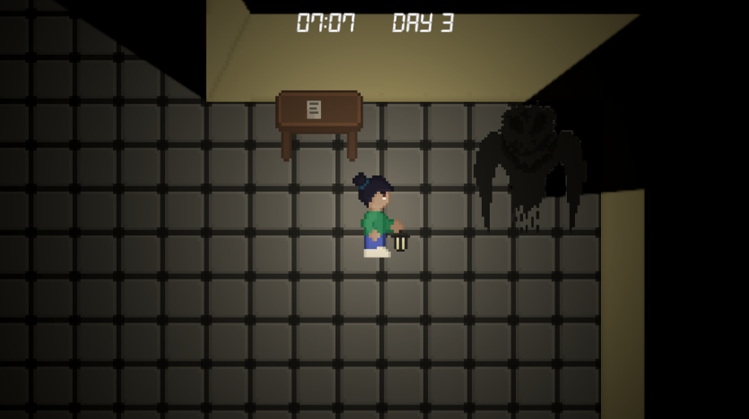
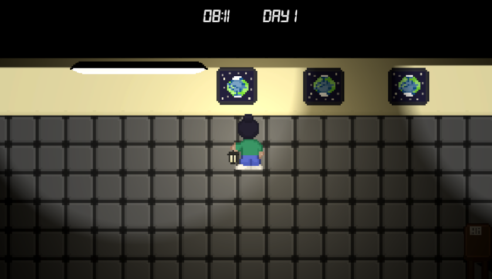
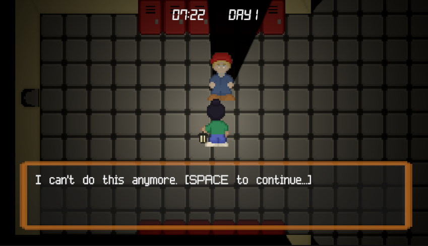

# Rooms – GMTK Game Jam 2025

## Overview
**Rooms** is a 2D top-down Unity 6 project developed for the **GMTK Game Jam 2025**.  
The game features interactive environments, dialogue systems, NPC/monster AI, checkpoint-based progression, and loop-based gameplay mechanics.

## Features
- **Unity 6 (6000.0.47f1)** project using the **Unity Input System**  
- Modular **interaction framework** for various object types:
  - Switches, pictures, cracks, and other interactables
  - NPC interactions with dialogue sequences
  - Monster encounters with custom movement and exit logic
- **Loop-based progression** controlled by a loop counter and checkpoint system
- **Dialogue system** with data-driven content (`DialogData` and `DialogManager`)
- **Checkpoint system** to manage player progress
- **Ghost talk** and event-triggered conversations
- Separation of gameplay logic into **managers** (e.g., `CheckpointManager`)
- Scene-based progression and state management

## Folder Structure
```
Assets/
 ├── Scripts/
 │    ├── Managers/
 │    ├── Interaction/
 │    │    ├── Checkpoints/
 │    │    ├── NPC/
 │    │    ├── Monster/
 │    │    ├── GhostTalk/
 │    ├── Dialog/
 │    ├── LoopCounter/
 │    └── ...
 ├── InputSystem_Actions.cs
 └── ...
Packages/
ProjectSettings/
```

## Installation
1. Clone the repository:
   ```bash
   git clone https://github.com/<your-username>/<your-repo>.git
   ```
2. Open the project in **Unity 6000.0.47f1** or later.
3. Ensure the **Unity Input System** package is installed (see `Packages/manifest.json`).

## Controls
The game uses Unity’s **Input System** with an `InputSystem_Actions` asset. Default mappings:
- **Movement**: WASD / Arrow Keys
- **Interact**: E
- **Other actions**: As defined in `InputSystem_Actions.cs`

## Screenshots
 
 


## Development Notes
- Interaction logic is implemented via the `Interactable` base class and extended by object-specific scripts.
- Dialogue is managed through `DialogManager` with serialized `DialogData` assets.
- AI movement patterns for NPCs and monsters are handled by dedicated controllers.
- Loop and checkpoint management enable replayable room sequences.

## License
This project is licensed under the MIT License
